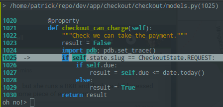

Debug
*****

After watching, `Clayton Parker - So you think you can PDB? - PyCon 2015`_, I
have started using pdbpp_.

I think you might like it...

Add the following to ``requirements/local.txt``::

  setuptools_scm
  # must come after ``setuptools_scm``
  pdbpp

.. note:: If you get a ``setuptools_scm`` error when installing ``pdbpp``, then
          manually install ``setuptools_scm``
          i.e. ``pip install setuptools_scm``

.. note:: You might want to remove ``ipdb`` (if you have been using it).
          ``ipython`` still appears to work in the Django shell.

Download a nice looking ``.pdbrc.py`` file and copy to your home folder.
I downloaded this one:
https://github.com/claytron/dotfiles/blob/master/.pdbrc.py

To debug, add the following to the line of your code where you want the
breakpoint:

.. code-block:: python

  import pdb; pdb.set_trace()

.. _`Clayton Parker - So you think you can PDB? - PyCon 2015`: https://www.youtube.com/watch?v=P0pIW5tJrRM
.. _pdbpp: https://pypi.python.org/pypi/pdbpp/
