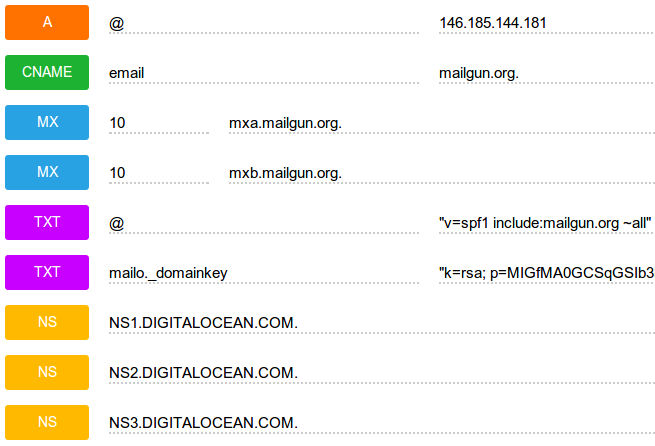

Mailgun
*******

.. highlight::python

Configuration
=============

Create a mailgun domain for your site (e.g. ``hatherleigh.info``) and set-up
the DNS records e.g:

Using https://mailgun.com/cp/routes, create a route for your Mailgun domain
(change ``pkimber.net`` to the domain name of your own site)::

  Priority              0
  Filter Expressions    match_recipient(".*@pkimber.net")
  Actions               forward("https://pkimber.net/mailgun/incoming/")

.. note::

  As shown above, append ``/mailgun/incoming/`` to your domain name.

Project
=======

To integrate http://www.mailgun.com/ into your project...

Send email
----------

Add the following to your requirements::

  django-mailgun==0.2.2

Add the following to ``settings/production.py``::

  # django-mailgun
  EMAIL_BACKEND = 'django_mailgun.MailgunBackend'
  MAILGUN_ACCESS_KEY = get_env_variable("MAILGUN_ACCESS_KEY")
  MAILGUN_SERVER_NAME = get_env_variable("MAILGUN_SERVER_NAME")

Make sure you include a ``mailgun_access_key`` somewhere in your pillar.

Setting this as a global variable is probably a good idea because it will
be the same for all your sites e.g:

.. code-block:: yaml

  mail:
    mailgun_access_key: 'your mailgun key'

In your Salt pillar for the site enable ``mailgun_send``.

If the mailgun domain is different to the site domain add a ``mailgun_domain``
e.g:

.. code-block:: yaml

  sites:
    hatherleigh_net:
      domain: hatherleigh.net
      mailgun_domain: mg.hatherleigh.net
      mailgun_receive: True
      mailgun_send: True

Receive email
-------------

If you want to receive mail, add the following to ``requirements/base.txt``::

  git+https://github.com/hedberg/django-mailgun-incoming.git#egg=mailgun_incoming

Until this pull request has been accepted
https://github.com/hedberg/django-mailgun-incoming/pull/1
then use my fork::

  git+https://github.com/pkimber/django-mailgun-incoming.git#egg=mailgun_incoming

Add the following to ``THIRD_PARTY_APPS`` in ``settings/base.py``::

  'mailgun_incoming',

Add the following to ``project/urls.py``::

  urlpatterns = patterns(
      ...
      url(regex=r'^mailgun/',
          view=include('mailgun_incoming.urls')
          ),
      ...

In your Salt pillar for the site, enable ``mailgun_receive``

Check the mailgun URL for your site (appending ``/mailgun/incoming/`` to the
site URL).

e.g using https://github.com/jkbr/httpie::

  $ http GET http://hatherleigh.info/mailgun/incoming/
  HTTP/1.1 405 METHOD NOT ALLOWED

See :doc:`process` for notes on how to check incoming mail.
