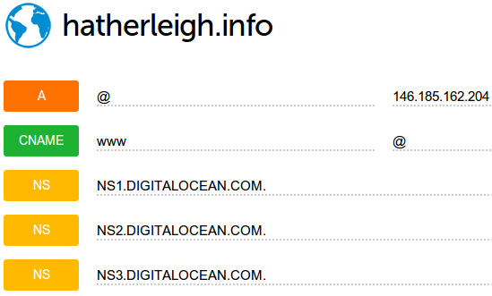

Process
*******

.. highlight:: bash

Prerequisites
=============

devpi
-----

Your team will need a http://doc.devpi.net/ server.  To set one up, follow the
*Prerequisites* instructions in the :doc:`devpi` document.

If your team already has a ``devpi`` server, then it should be listed in the
:doc`checklist`.

Workstation
===========

To set-up your workstation for development:

:doc:`dev-env`

To deploy a site from scratch:

Domain
======

Purchase a domain name from http://dyn.com/

Set the name servers e.g. in https://account.dyn.com/services/zones/.  Point
the domain to the https://cloud.digitalocean.com/domains DNS server::

  ns1.digitalocean.com
  ns2.digitalocean.com
  ns3.digitalocean.com

Google Mail
===========

If your customer would like to use Google Mail

Cloud Server
=============

Create a cloud server for your project: :doc:`salt-cloud-digitalocean` or
:doc:`salt-cloud-rackspace`.

Set-up the basic DNS records e.g.

.. note:: Don't forget to add a ``CNAME`` entry for the ``www`` subdomain.

If you are using mailgun for your project, then enable it: :doc:`mailgun`

.. important:: Your site doesn't yet have ``https`` enabled, so for the
               *Action* on the mailgun route, use ``http`` (not ``https``).

Server
======

Set-up your pillar :doc:`site-config`

.. important:: Set-up your site with ``ssl: False``

Transfer the pillar to the salt master and then :doc:`salt-provision`

Create the database for your project: :doc:`fabric-database`

Release your project: :doc:`fabric-release`

Deploy your project to the server: :doc:`fabric-deploy`

Mailgun Testing
===============

If you are using Mailgun...

Check the mailgun domain to make sure the DNS records are set-up correctly.

Send a test email to your site e.g. ``test@hatherleigh.info``

Log into your cloud server and check the email was received e.g::

  ssh drop-temp
  sudo -i -u web
  hatherleigh_info.sh shell

.. code-block:: python

  from mailgun_incoming.models import IncomingEmail
  for mail in IncomingEmail.objects.all().order_by('-id'): print(mail.subject, mail.body_plain)

SSL
===

Create an SSL certificate: :doc:`ssl`.

Read any emails using your mail client - or for Mailgun - the python code in
the previous step.

.. note:: If using http://www.startssl.com/ then send emails to ``webmaster``.

Copy the SSL certificate to the server: :doc:`fabric-ssl`

After installing the certificate, run a ``salt 'drop-temp' state.highstate``
for your server so the site is set-up correctly for SSL.

Finally
=======

.. important:: If you are using Mailgun, change the *Action* on the route
               filter to use ``https``: :doc:`mailgun`
